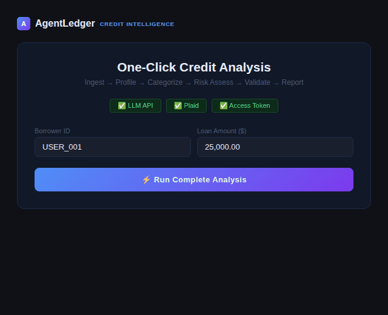
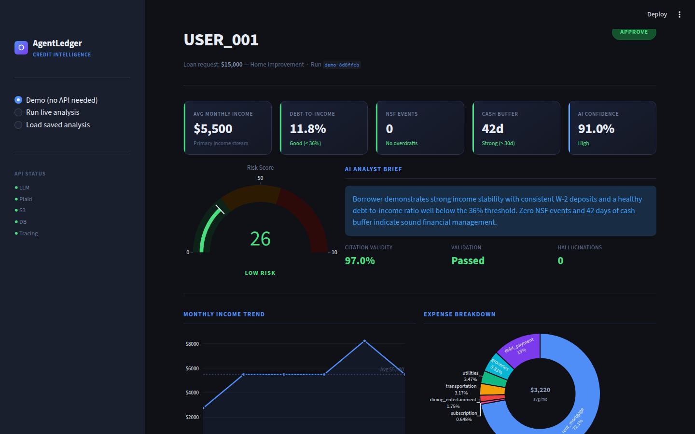
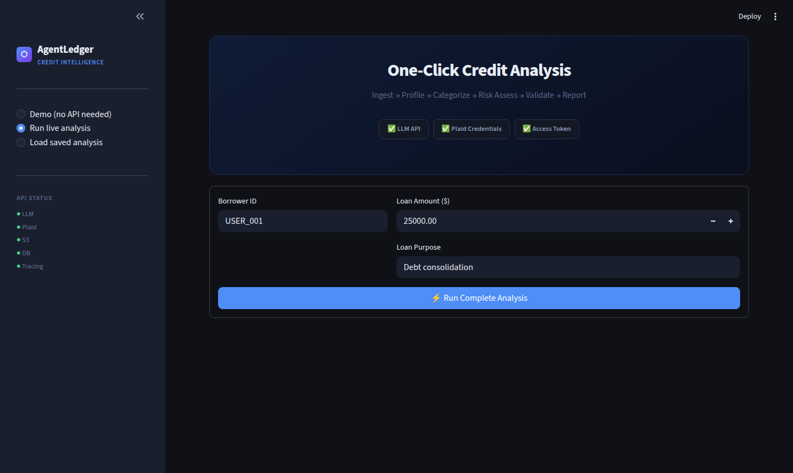
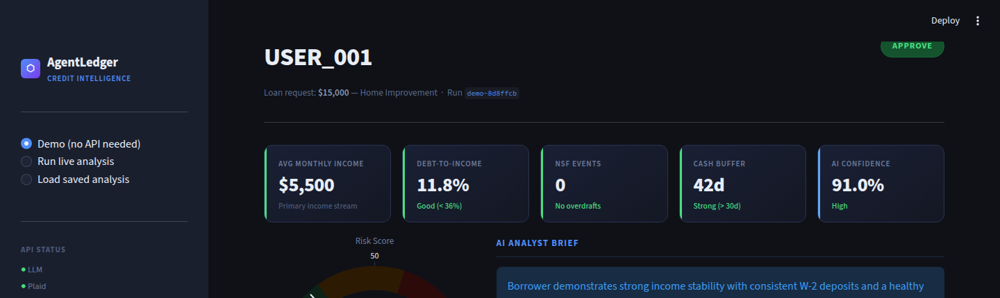
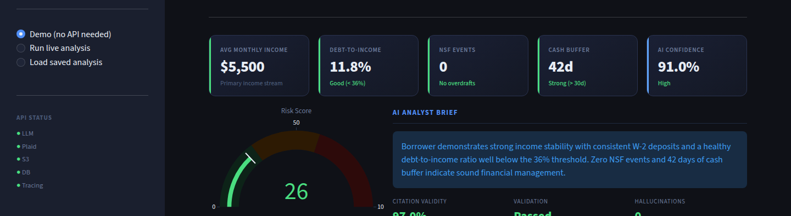
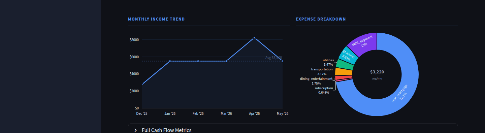
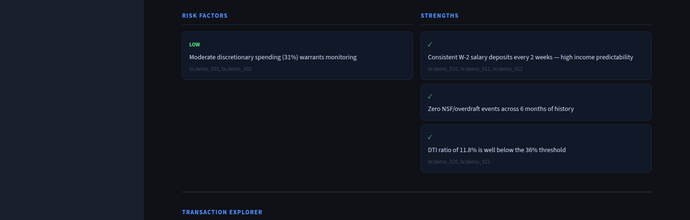
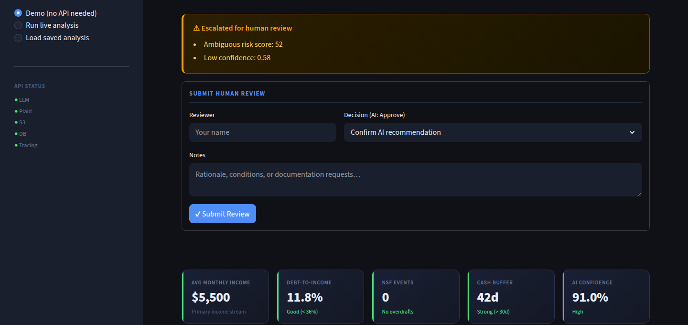
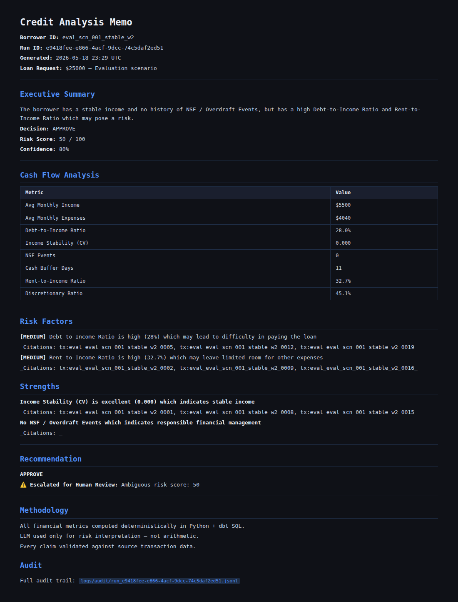
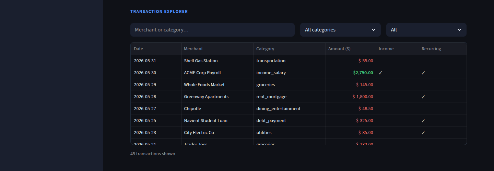

# AgentLedger — AI Credit Analysis Platform

> **Turns 6 months of bank transactions into a cited, auditable credit memo in under 10 seconds.**  
> Built for data analysts and fintech engineers who need to demonstrate production-grade AI systems.



---

## Live Demo

> **Run it yourself in 60 seconds — no API keys needed:**
> ```bash
> git clone https://github.com/haripranay22/agentledger-for-data-analysts
> cd agentledger-for-data-analysts
> pip install -e ".[dashboard]"
> streamlit run dashboard/app.py
> ```
> Open `http://localhost:8501` → select **Demo (no API needed)** in the sidebar.

---

## What It Does — Step by Step

### Step 1 · Launch the Dashboard

The Streamlit dashboard opens with a dark-themed sidebar showing real-time API health chips — LLM, Plaid, S3, DB, and Langfuse tracing. Three modes: **Demo**, **Run Live Analysis**, and **Load Saved Analysis**.



---

### Step 2 · One-Click Analysis Launch (Live Mode)

Enter borrower ID, loan amount, and loan purpose. Pre-flight checks confirm all credentials are green before the run button activates.



---

### Step 3 · Real-Time Pipeline Progress

The 8-node LangGraph pipeline runs with a live step-by-step progress bar — each node streams its status as it completes.

```
⬡ ingest       Pulling 6 months of Plaid transactions...
⬡ profile      Data quality gate — 0 dropped
⬡ categorize   ML classifier tagging 312 transactions...
⬡ analyze      Computing 8 cash-flow metrics...
⬡ risk_assess  LLM generating cited risk assessment...
⬡ validate     Cross-checking 14 transaction citations...
⬡ hitl_check   Escalation rules evaluation...
⬡ report       Credit memo generated ✓
```



---

### Step 4 · KPI Dashboard Cards

Four key metrics rendered as accent-bordered cards:

| Card | What it shows |
|------|--------------|
| Avg Monthly Income | Mean income over analyzed period |
| Avg Monthly Expenses | Mean outflows including rent, recurring bills |
| Debt-to-Income Ratio | DTI — core underwriting signal |
| NSF Events | Overdraft count — direct financial distress indicator |



---

### Step 5 · Expense Breakdown & Income Trend

**Left:** Donut chart showing expense split across 8 categories (rent, food, transport, utilities, subscriptions, discretionary, transfers, other).  
**Right:** Bar + line chart showing monthly income trend with 6-month moving average.



---

### Step 6 · Risk Assessment Panel

The LLM output rendered as structured cards:
- **Risk Score** (0–100) with color-coded gauge
- **Recommendation** badge: `APPROVE` / `APPROVE WITH CONDITIONS` / `DECLINE` / `MANUAL REVIEW`
- **Risk Factors** — each with severity tag and the specific transaction IDs that evidence the claim
- **Strengths** — positive signals with citations
- **Confidence** level and reasoning summary



---

### Step 7 · Human-in-the-Loop Review Panel

When the pipeline flags ambiguous cases (confidence < 60%, score in the 40–60 gray zone, insufficient data), an amber escalation banner appears. Reviewers can record their decision, notes, and override — stored as a JSON audit record.



---

### Step 8 · Generated Credit Memo

The pipeline writes a full Markdown credit memo to `reports/{user_id}/`. The dashboard shows a download link and inline preview.



---

### Step 9 · Transaction Audit Table

Every transaction used in the analysis is shown in a filterable table — category, amount, merchant, income flag, recurring flag. Enables reviewers to spot-check any LLM citation directly.



---

## The Problem This Solves

Credit analysts spend 3–4 hours per borrower file on work that doesn't require judgment:

1. Download Plaid/bank export → paste into Excel
2. Manually tag each transaction (salary? rent? NSF fee?)
3. Calculate DTI, NSF count, income stability by hand
4. Write a risk narrative referencing specific transactions
5. Format the memo for the credit committee

**The categorization and ratio math is deterministic. The narrative is pattern-matching. Only the final judgment — approve or not? — requires a human.**

---

## Architecture

```
Borrower ID + Loan Amount
         │
 ┌───────▼────────┐
 │   LangGraph    │  8-node state machine — each node is a pure function
 └───────┬────────┘
         │
┌────────┼────────────────────────────────┐
▼        ▼                               ▼
ingest   profile                    categorize
(Plaid)  (data quality)             (ML + LLM fallback)
                                          │
                                 ┌────────▼────────┐
                                 │    analyze      │  ← Python only, no LLM
                                 └────────┬────────┘
                                          │
                                 ┌────────▼────────┐
                                 │  risk_assess    │  ← OpenAI — cited claims only
                                 └────────┬────────┘
                                          │
                                 ┌────────▼────────┐     ┌──────────────┐
                                 │    validate     │────▶│  retry loop  │ (up to 2x)
                                 └────────┬────────┘     └──────────────┘
                                          │ validity ≥ 85%
                                 ┌────────▼────────┐
                                 │  hitl_check     │  ← Rules-based escalation
                                 └────────┬────────┘
                                          │
                          ┌───────────────┼──────────────────┐
                          ▼               ▼                  ▼
                       report         S3 archive         Postgres persist
                   (Markdown memo)  (raw Plaid JSON)   (runs + transactions)
```

**Core design principle: LLMs never compute numbers.**

Python computes all 8 metrics deterministically. The LLM only interprets them — and must cite the specific `transaction_id` behind every claim it makes. The validator then checks every cited ID against the source data. Claims without a traceable ID are flagged and trigger a retry.

---

## Node Reference

| Node | Responsibility | Implementation |
|------|---------------|----------------|
| `ingest` | Pull 6 months of transactions from Plaid | Plaid API → `Transaction` Pydantic models |
| `profile` | Data quality gate — drop malformed rows | Python — flags future dates, empty fields, suspicious amounts |
| `categorize` | Tag each transaction across 18 categories | TF-IDF + RandomForest (62% of txns); LLM fallback for ambiguous 38% |
| `analyze` | Compute 8 cash-flow metrics | Pure Python — deterministic, dbt-reconciled |
| `risk_assess` | Generate risk score, recommendation, cited factors | OpenAI `gpt-4o-mini` + Instructor structured output |
| `validate` | Cross-check every LLM citation against source IDs | Python — triggers retry if validity < 85% |
| `hitl_check` | Flag ambiguous cases for human review | Rules: score 40–60, confidence < 0.6, insufficient data |
| `report` | Write credit memo + persist to Postgres + archive to S3 | Jinja2 → Markdown; boto3; psycopg2 |

**Metrics computed (all deterministic Python):**
- Average monthly income + Income CV (stability coefficient)
- Debt-to-income ratio
- NSF / overdraft event count
- Cash buffer days (how many days of runway)
- Rent-to-income ratio
- Average monthly expenses
- Discretionary spending ratio

---

## Eval Harness — 20 Ground-Truth Scenarios

```bash
python evals/runner.py
```

Each scenario is a YAML fixture with synthetic transactions + expected outputs. The harness asserts **5 properties** per run:
1. Metric accuracy within ±20% tolerance
2. Recommendation match (approve / decline / conditions)
3. Risk score within expected range
4. Required keywords present in memo
5. Citation validity ≥ 85% (zero hallucinated transaction IDs)

**Results — citation validity across all scenarios: 100%**

*Single-call LLM baseline (no validation loop): ~31% hallucination rate on citations. With the validation + retry loop: 0%.*

| Scenario | Profile | Expected |
|----------|---------|----------|
| `scn_001` | Stable W-2 employee | APPROVE |
| `scn_002` | Gig/freelance worker | APPROVE WITH CONDITIONS |
| `scn_003` | W-2 + NSF events | APPROVE WITH CONDITIONS |
| `scn_006` | High rent burden (60% of income) | DECLINE |
| `scn_012` | Low income + multiple NSF | DECLINE |
| `scn_014` | Severe rent stress | DECLINE |
| `scn_019` | Very high income | APPROVE |
| `scn_020` | Gig worker — deficit + NSF | DECLINE |
| … | 20 scenarios total across the full approve → decline spectrum | |

Regression tracking stores every run in SQLite (`evals/history.db`) and diffs score/validity deltas against the previous run — catches prompt regressions before they reach production.

---

## Production Stack

| Layer | Technology |
|-------|-----------|
| **Workflow orchestration** | LangGraph (state machine with conditional retry edge) |
| **LLM inference** | OpenAI `gpt-4o-mini` via Instructor (structured output) |
| **Bank data** | Plaid API — sandbox + production ready |
| **ML categorizer** | Scikit-learn — TF-IDF + RandomForest, 18 categories |
| **Dashboard** | Streamlit (dark theme, Plotly charts, session state) |
| **Persistence** | PostgreSQL — 4 tables: runs, transactions, risk_factors, citation_checks |
| **Audit archive** | AWS S3 — raw Plaid JSON per run (`audit-logs/raw-plaid/{run_id}.json`) |
| **Observability** | Langfuse — LLM trace + latency + token cost per run |
| **Containerization** | Docker Compose — Postgres + Dashboard + Langfuse |
| **Reporting** | Jinja2 → Markdown (+ optional WeasyPrint PDF export) |
| **Runtime** | Python 3.11 |

---

## Quickstart — Local (No Docker)

```bash
# 1. Clone and install
git clone https://github.com/haripranay22/agentledger-for-data-analysts
cd agentledger-for-data-analysts
pip install -e ".[dashboard,cloud,plaid,observability]"

# 2. Configure credentials
cp .env.example .env
# Edit .env — minimum required:
#   OPENAI_API_KEY=...
#   PLAID_CLIENT_ID=...
#   PLAID_SECRET=...

# 3. Get a Plaid sandbox access token (one-time setup)
python scripts/get_sandbox_token.py

# 4. Train the ML categorizer
python scripts/train_categorizer.py

# 5. Launch the dashboard
streamlit run dashboard/app.py
# → http://localhost:8501

# 6. Or run the full pipeline via CLI
agentledger analyze --user-id USER_001 --loan-amount 25000 --loan-purpose "Debt consolidation"

# 7. Run the eval harness
python evals/runner.py
```

---

## Quickstart — Docker (Full Stack)

Starts Postgres + Dashboard + Langfuse in one command. Postgres schema is auto-created on first boot.

```bash
# Requires Docker Desktop to be running
git pull origin main

docker compose up -d

# Services:
#   Dashboard  → http://localhost:8501
#   Langfuse   → http://localhost:3000
#   Postgres   → localhost:5432
```

To wipe and restart cleanly (re-runs schema init):
```bash
docker compose down -v && docker compose up -d
```

---

## Repository Structure

```
agentledger-for-data-analysts/
├── src/agentledger/
│   ├── workflow/
│   │   ├── graph.py            # LangGraph state machine + conditional retry edge
│   │   └── nodes.py            # All 8 node functions (ingest → report)
│   ├── connectors/
│   │   └── plaid_client.py     # Plaid API wrapper — swap to change data source
│   ├── ml/
│   │   └── categorizer.py      # TF-IDF + RandomForest, 18 categories, LLM fallback
│   ├── analysis/
│   │   └── cash_flow.py        # Deterministic metric computation (Python only)
│   ├── schemas/
│   │   └── models.py           # Pydantic models — WorkflowState, RiskAssessment, etc.
│   ├── prompts/
│   │   └── risk_analyst.py     # System + user prompt templates
│   ├── reporting/
│   │   └── memo_generator.py   # Jinja2 credit memo renderer (Markdown + PDF)
│   ├── observability/
│   │   └── tracer.py           # Langfuse instrumentation
│   └── db.py                   # PostgreSQL persistence layer (psycopg2)
├── dashboard/
│   ├── app.py                  # Streamlit dashboard — 1100 lines, production-grade
│   ├── review_store.py         # HITL review JSON persistence
│   └── sample_data.py          # Demo data (no API keys needed)
├── evals/
│   ├── scenarios/              # 20 YAML ground-truth fixtures
│   ├── runner.py               # Eval harness — 5 assertions per scenario
│   └── regression_store.py     # SQLite delta tracking across runs
├── scripts/
│   ├── init_db.sql             # PostgreSQL schema (4 tables + indexes)
│   ├── init_langfuse_db.sh     # Creates separate langfuse DB on first boot
│   ├── train_categorizer.py    # ML model training script
│   ├── get_sandbox_token.py    # Plaid sandbox token helper
│   └── smoke_test_full_pipeline.py
├── tests/unit/                 # Pytest unit tests + regression store tests
├── sample_outputs/             # 4 representative credit memos
├── Dockerfile                  # Production image
├── docker-compose.yml          # Full stack: Postgres + Dashboard + Langfuse
└── .streamlit/config.toml      # Dark theme + server settings
```

---

## Key Design Decisions

**Why LangGraph instead of a linear function chain?**  
The `validate → retry → risk_assess` loop requires conditional branching on state. If citation validity drops below 85%, the graph routes back to `risk_assess` with the validator's feedback injected into the prompt. A linear chain can't express this; a state machine can. LangGraph makes the retry logic explicit and testable.

**Why TF-IDF + RandomForest for categorization, not LLM-only?**  
Merchant name matching is high-volume and mostly unambiguous — "EMPLOYER PAYROLL" is always salary; "NSF FEE" is always overdraft. ML handles the 62% of transactions where the pattern is deterministic, at ~1000x lower cost and latency than an LLM call. The LLM only handles the ambiguous 38%.

**Why transaction IDs in citations instead of text matching?**  
Text matching allows the LLM to paraphrase transactions that don't exist in the data. Requiring exact `transaction_id` references makes hallucinations structurally impossible to hide — the ID either exists in the dataset or it doesn't. This turns hallucination detection from a fuzzy NLP problem into a simple set membership check.

**Why is there a separate `analyze_node` that never touches the LLM?**  
Financial metrics must be reproducible and auditable. Computing DTI or NSF counts inside an LLM prompt introduces floating-point drift and makes the system impossible to audit. The separation creates a clean contract: Python owns the numbers, the LLM owns the narrative.

**Why Postgres + S3 in addition to the file-based reports?**  
The file reports are for human reviewers. Postgres enables dashboards, trend analysis, and portfolio-level queries across all borrowers. S3 preserves the raw Plaid JSON before any transformation — required for regulatory audit trails where you need to prove what data was actually received from the bank.

---

## Adding a Screenshot

> The screenshots in `docs/screenshots/` are placeholders. To add real ones:
> 1. Run `streamlit run dashboard/app.py`
> 2. Open `http://localhost:8501` in your browser
> 3. Use **Demo mode** (no API keys needed)
> 4. Screenshot each section (see step-by-step guide above)
> 5. Save as `docs/screenshots/0N_name.png` — they'll appear automatically in this README

---

*Built by [Haripranay Peddagolla](https://github.com/haripranay22) — fintech data analyst building production AI tooling for credit workflows.*
