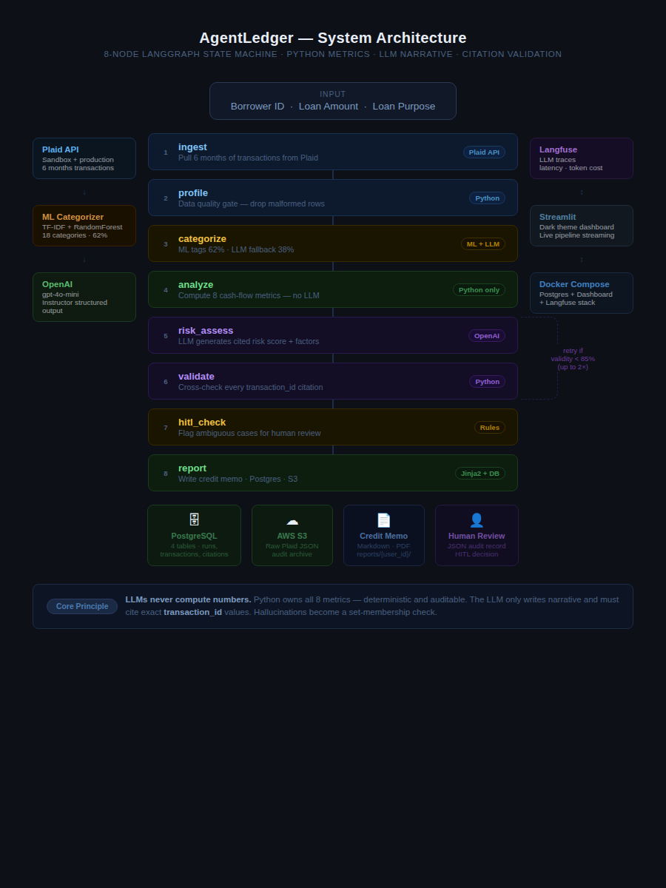

# AgentLedger — AI Credit Analysis Platform

> **Turns 6 months of bank transactions into a cited, auditable credit memo in under 10 seconds.**  
> Built for data analysts and fintech engineers who need to demonstrate production-grade AI systems.


---

## Live Demo

> **Run it yourself in 60 seconds — no API keys needed:**
> ```bash
> git clone https://github.com/haripranay22/agentledger-for-data-analysts
> cd agentledger-for-data-analysts
> pip install -e ".[dashboard]"
> python scripts/train_categorizer.py
> streamlit run dashboard/app.py
> ```
> Open `http://localhost:8501` → select **Demo (no API needed)** in the sidebar.

---

## What It Does — Step by Step

### Step 1 · Open the Dashboard

Dark-themed Streamlit app with a sidebar showing real-time API health dots — **LLM**, **Plaid**, **S3**, **DB**, **Tracing**. All green when credentials are set. Three analysis modes in the sidebar.


---

### Step 2 · Configure & Launch Analysis

Select **Run live analysis**, enter Borrower ID, Loan Amount, and Loan Purpose. Pre-flight badges confirm credentials before the **⚡ Run Complete Analysis** button activates.


---

### Step 3 · Pipeline Runs Node by Node

The 8-node LangGraph pipeline streams live — each node lights up as it completes. The GIF at the top shows this in real time.


The full node sequence:
```
1  ingest        Pull 6 months of transactions from Plaid
2  profile       Data quality gate — drop malformed rows  
3  categorize    ML classifier tags all transactions
4  analyze       Compute 8 cash-flow metrics (Python only, no LLM)
5  risk_assess   OpenAI generates cited risk assessment
6  validate      Cross-check every transaction ID citation
7  hitl_check    Rules-based escalation evaluation
8  report        Write credit memo + persist to Postgres + S3
```

---

### Step 4 · KPI Cards + Risk Gauge

Five metric cards render instantly after the run — income, DTI, NSF events, cash buffer, AI confidence. The risk gauge shows score 0–100 with the AI Analyst Brief alongside citation validity and hallucination count.


---

### Step 5 · Income Trend + Expense Breakdown

**Left:** 6-month income trend line with average baseline.  
**Right:** Expense breakdown donut across 8 categories — rent, groceries, debt payments, utilities, transport, dining, subscriptions, other.


---

### Step 6 · Risk Factors & Strengths

Every LLM claim is backed by real `transaction_id` citations. Risk factors show severity (LOW / MEDIUM / HIGH). Strengths show positive signals. Both are validated — any hallucinated citation triggers an automatic retry.


---

### Step 7 · Human-in-the-Loop Escalation

When the pipeline flags an ambiguous case — risk score 40–60, confidence below 60%, or insufficient data — an amber banner appears. The reviewer fills in their name, decision, and notes. The review is saved as a JSON audit record.


---

### Step 8 · Generated Credit Memo

The pipeline renders a full Markdown credit memo with executive summary, cash flow table with benchmarks, risk factors with citations, strengths, and final recommendation. Saved to `reports/{user_id}/`.


---

### Step 9 · Transaction Audit Table

Every transaction is browsable — merchant, category, amount, income flag, recurring flag. Reviewers can search by merchant or filter by category to verify any LLM citation directly.


---

## The Problem This Solves

Credit analysts spend **3–4 hours per borrower file** on work that doesn't require judgment:

1. Download Plaid/bank export → paste into Excel
2. Manually tag each transaction (salary? rent? NSF fee?)
3. Calculate DTI, NSF count, income stability by hand
4. Write a risk narrative referencing specific transactions
5. Format the memo for the credit committee

**The categorization and ratio math is deterministic. The narrative is pattern-matching. Only the final judgment — approve or not? — requires a human.**

AgentLedger automates steps 1–4 and drafts step 5, reducing per-file analyst time from ~4 hours to under 15 minutes.

---

## Architecture



**Core design principle: LLMs never compute numbers.**

Python computes all 8 metrics deterministically. The LLM only interprets them and must cite the exact `transaction_id` behind every claim. The validator checks every ID against the source — hallucinations trigger a retry with corrective feedback injected into the prompt.

---

## Node Reference

| Node | What it does | How |
|------|-------------|-----|
| `ingest` | Pull 6 months of transactions from Plaid | Plaid API → `Transaction` Pydantic models |
| `profile` | Data quality gate — drop malformed rows | Flags future-dated, empty fields, suspicious amounts |
| `categorize` | Tag each transaction across 18 categories | TF-IDF + RandomForest (62%); LLM fallback (38%) |
| `analyze` | Compute 8 cash-flow metrics | Pure Python — deterministic |
| `risk_assess` | Generate risk score + cited factors | OpenAI `gpt-4o-mini` + Instructor structured output |
| `validate` | Cross-check every LLM citation | Python — retries if validity < 85% |
| `hitl_check` | Flag ambiguous cases for human review | Rules: score 40–60, confidence < 0.6 |
| `report` | Write memo + persist to Postgres + S3 | Jinja2 + psycopg2 + boto3 |

**8 metrics computed (all deterministic Python):**

| Metric | What it signals |
|--------|----------------|
| Avg Monthly Income | Baseline earning capacity |
| Income CV | Stability — gig workers score higher |
| Avg Monthly Expenses | Total outflow |
| Debt-to-Income Ratio | Core underwriting threshold (< 36%) |
| NSF Events | Overdraft count — financial distress indicator |
| Cash Buffer Days | Runway at current burn rate |
| Rent-to-Income Ratio | Housing cost burden |
| Discretionary Spending Ratio | Lifestyle spend as % of income |

---

## Eval Harness — 20 Ground-Truth Scenarios

```bash
python evals/runner.py
```

Each scenario is a YAML fixture with synthetic transactions + expected outputs. The harness asserts **5 properties per run**:

1. Metric accuracy within ±20% tolerance
2. Recommendation match (approve / decline / conditions)
3. Risk score within expected range
4. Required keywords present in memo
5. Citation validity ≥ 85%

**Citation validity across all 20 scenarios: 100%**

> Single-call LLM baseline (no validation loop): ~31% hallucination rate.  
> With the validation + retry loop: **0%**.

| Scenario | Profile | Decision |
|----------|---------|----------|
| `scn_001` | Stable W-2 employee, zero NSF | APPROVE |
| `scn_002` | Gig/freelance worker | APPROVE WITH CONDITIONS |
| `scn_003` | W-2 + 1 NSF event | APPROVE WITH CONDITIONS |
| `scn_006` | Rent = 60% of income | DECLINE |
| `scn_012` | Low income + multiple NSF | DECLINE |
| `scn_014` | Severe rent stress | DECLINE |
| `scn_019` | Very high income, clean profile | APPROVE |
| `scn_020` | Gig worker — spending deficit + NSF | DECLINE |
| … | 20 scenarios across the full approve → decline spectrum | |

Regression tracking stores every eval run in SQLite (`evals/history.db`) and diffs score/validity deltas — catches prompt regressions before they reach production.

---

## Production Stack

| Layer | Technology |
|-------|-----------|
| **Workflow orchestration** | LangGraph — state machine with conditional retry edge |
| **LLM inference** | OpenAI `gpt-4o-mini` via Instructor (structured Pydantic output) |
| **Bank data** | Plaid API — sandbox + production-ready |
| **ML categorizer** | Scikit-learn — TF-IDF + RandomForest, 18 categories |
| **Dashboard** | Streamlit — dark theme, Plotly charts, live pipeline streaming |
| **Persistence** | PostgreSQL — 4 tables: runs, transactions, risk_factors, citation_checks |
| **Audit archive** | AWS S3 — raw Plaid JSON per run at `audit-logs/raw-plaid/{run_id}.json` |
| **Observability** | Langfuse — LLM trace, latency, token cost per run |
| **Containerization** | Docker Compose — Postgres + Dashboard + Langfuse |
| **Reporting** | Jinja2 → Markdown (+ optional WeasyPrint PDF) |
| **Runtime** | Python 3.11 |

---

## Quickstart — Local

```bash
# 1. Clone and install
git clone https://github.com/haripranay22/agentledger-for-data-analysts
cd agentledger-for-data-analysts
pip install -e ".[dashboard,cloud,plaid,observability]"

# 2. Configure credentials
cp .env.example .env
# Fill in: OPENAI_API_KEY, PLAID_CLIENT_ID, PLAID_SECRET, PLAID_ACCESS_TOKEN

# 3. Train the ML categorizer (one-time)
python scripts/train_categorizer.py

# 4. Launch the dashboard
streamlit run dashboard/app.py
# → http://localhost:8501  (Demo mode works without any API keys)

# 5. Or run via CLI
agentledger analyze --user-id USER_001 --loan-amount 25000 --loan-purpose "Debt consolidation"

# 6. Run the eval harness
python evals/runner.py
```

---

## Quickstart — Docker (Full Stack)

```bash
# Docker Desktop must be running
git pull origin main
docker compose up -d

# Dashboard  → http://localhost:8501
# Langfuse   → http://localhost:3000
# Postgres   → localhost:5432
```

Postgres schema auto-creates on first boot. To wipe and restart cleanly:
```bash
docker compose down -v && docker compose up -d
```

---

## Repository Structure

```
agentledger-for-data-analysts/
├── src/agentledger/
│   ├── workflow/
│   │   ├── graph.py            # LangGraph state machine + conditional retry edge
│   │   └── nodes.py            # All 8 node functions (ingest → report)
│   ├── connectors/
│   │   └── plaid_client.py     # Plaid API wrapper
│   ├── ml/
│   │   └── categorizer.py      # TF-IDF + RandomForest, 18 categories, LLM fallback
│   ├── analysis/
│   │   └── cash_flow.py        # Deterministic metric computation
│   ├── schemas/
│   │   └── models.py           # Pydantic models — WorkflowState, RiskAssessment, etc.
│   ├── prompts/
│   │   └── risk_analyst.py     # System + user prompt templates
│   ├── reporting/
│   │   └── memo_generator.py   # Jinja2 credit memo renderer
│   ├── observability/
│   │   └── tracer.py           # Langfuse instrumentation
│   └── db.py                   # PostgreSQL persistence (psycopg2)
├── dashboard/
│   ├── app.py                  # Streamlit dashboard — dark theme, live streaming
│   ├── review_store.py         # HITL review JSON persistence
│   └── sample_data.py          # Demo data (no API keys needed)
├── evals/
│   ├── scenarios/              # 30 YAML ground-truth fixtures
│   ├── runner.py               # Eval harness — 5 assertions per scenario
│   └── regression_store.py     # SQLite delta tracking across runs
├── dbt/
│   ├── models/staging/         # stg_transactions — raw Plaid data
│   ├── models/intermediate/    # int_transactions_categorized
│   └── models/marts/           # fct_user_metrics — mirrors Python metrics
├── scripts/
│   ├── init_db.sql             # PostgreSQL schema (4 tables + indexes)
│   ├── train_categorizer.py    # ML model training (one-time)
│   ├── get_sandbox_token.py    # Plaid sandbox token helper
│   ├── smoke_test_risk_assess.py  # End-to-end LLM smoke test
│   ├── make_pipeline_gif.py    # Regenerate docs/pipeline_demo.gif
│   └── take_screenshots.py     # Regenerate docs/screenshots/
├── tests/
│   ├── unit/                   # Pytest unit tests (cash flow, categorizer, memo)
│   └── integration/            # Pipeline node integration tests
├── sample_outputs/             # 4 representative credit memos (approve/decline)
├── docs/
│   ├── architecture.png        # System architecture diagram
│   ├── pipeline_demo.gif       # Animated pipeline walkthrough
│   └── screenshots/            # 9 annotated dashboard screenshots
├── .github/workflows/
│   ├── ci.yml                  # Lint + type-check + unit tests on every push
│   └── smoke_test.yml          # Manual LLM pipeline smoke test
├── Dockerfile                  # Production image (python:3.11-slim)
├── docker-compose.yml          # Full stack: Postgres + Dashboard + Langfuse
├── pyproject.toml              # Package config, dependencies, tool settings
└── .streamlit/config.toml      # Dark theme + server config
```

---

## Key Design Decisions

**Why LangGraph instead of a linear function chain?**  
The `validate → retry → risk_assess` loop requires conditional branching on state. If citation validity drops below 85%, the graph routes back to `risk_assess` with the validator's feedback injected. A linear chain can't express this — a state machine can.

**Why TF-IDF + RandomForest for categorization, not LLM-only?**  
Merchant name matching is high-volume and mostly unambiguous. ML handles the 62% of transactions where the pattern is deterministic at ~1000x lower cost than an LLM call. The LLM only handles the ambiguous 38% where merchant context actually matters.

**Why transaction IDs in citations, not text matching?**  
Text matching lets the LLM paraphrase transactions that don't exist. Requiring exact `transaction_id` references makes hallucinations structurally impossible to hide — the ID either exists in the dataset or it doesn't. Hallucination detection becomes a set membership check.

**Why a separate `analyze_node` that never touches the LLM?**  
Financial metrics must be reproducible and auditable. Computing DTI or NSF counts inside an LLM prompt introduces drift and makes the output impossible to audit. Python owns the numbers; the LLM owns the narrative.

**Why Postgres + S3 alongside file reports?**  
File reports are for human reviewers. Postgres enables portfolio-level queries across all borrowers. S3 preserves raw Plaid JSON before any transformation — required for regulatory audit trails where you need to prove what data was actually received from the bank.

---

*Built by [Haripranay Peddagolla](https://github.com/haripranay22) — data analyst building production AI tooling for credit workflows.*
